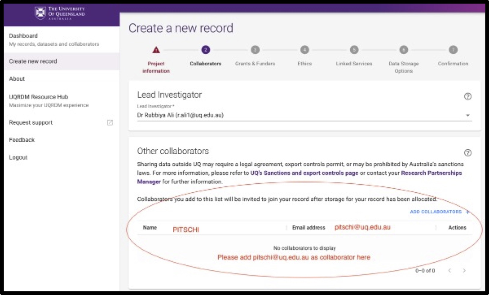

## How do I link/create an UQRDM collection for my project?

### Option 1: If you have an existing UQRDM collection (Q-collection)

You can use it for your CMM project only if:

- It is linked to your CMM project registered in [RIMS](https://rims.uq.edu.au/login/?pf=2).
- It is mountable to HPCs at UQ (so-called Q-collection).

please do the following:

- Add pitschi@uq.edu.au as a collaborator in the Q-collection.
- Please send the **UQRDM collection ID** to cmm-support@uq.edu.au.

	
<h4> Click here if you don't know where to find your collection ID? </h4>

	
Please follow the instructions to find your UQRDM collection ID. 
	
	
	1. Please click on the following link to login into your UQRDM collection with your UQ credentials.
  http://rdm.uq.edu.au/
	
	
	
	2. After login, please click on ‘Access Storage’.
	
	

	
	
	3. It’ll open another window with your UQRDM collection ID. 
	
	

	
		

### Option 2: If you do not have any UQRDM collection

If you do not have a UQRDM collection that meets the above requirements, you need to create a new one.

If you dont know how to create a new collection, please click on **details**

	
<h4> Click here if you don't know how to create a new UQRDM collection?</h4>

Please follow the instructions to create your new UQRDM collection. 
	
	1. Please click on the following link to create a new UQRDM collection for PITSCHI and login with your UQ credentials. 
  http://rdm.uq.edu.au/
	
	
	2. Click on ‘ Create new record’ on left sidebar of the page and add all details asked in the form.
	
	
	3. When it asks for Project name, please enter your complete ‘PPMS Project title’ (see screenshot below). 
	
	

		
  
	4. Please add pitschi@uq.edu.au as collaborator in the record. 
	

	  
	
	5.	Under ‘data storage options’ please select ‘project data needs to be mounted on UQ HPC facilities'
	
 
	
	
	6.	When you submit the form, and receive a confirmation from UQRDM team, please send the UQRDM collection number to cmm-support@uq.edu.au
	

