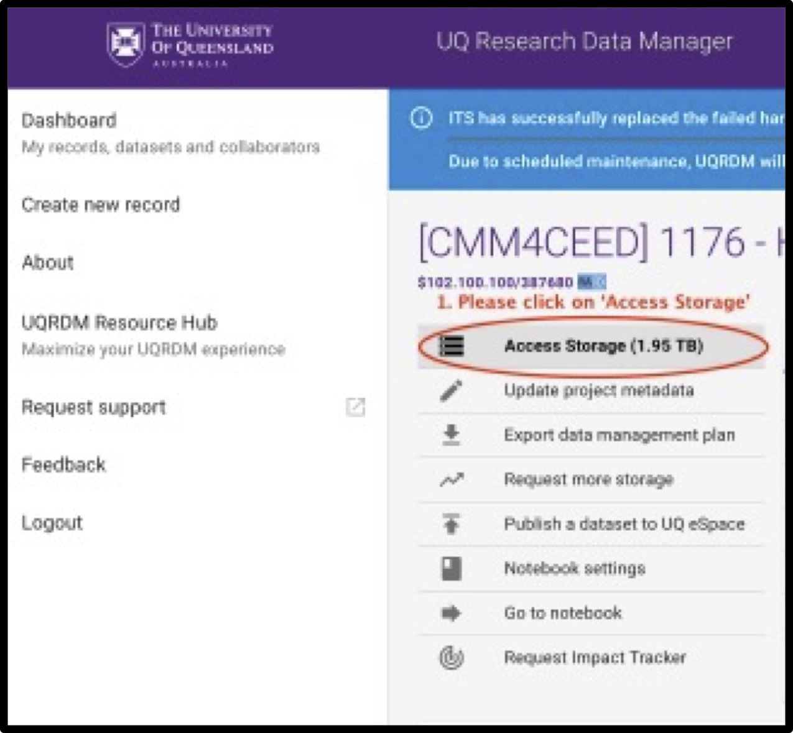
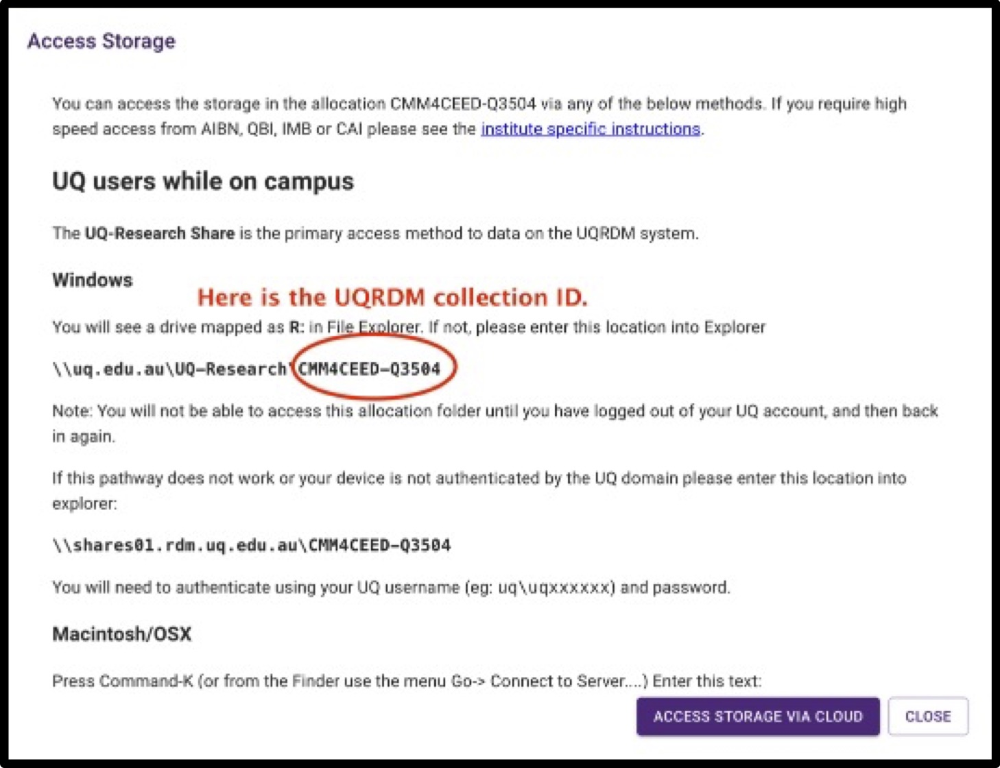
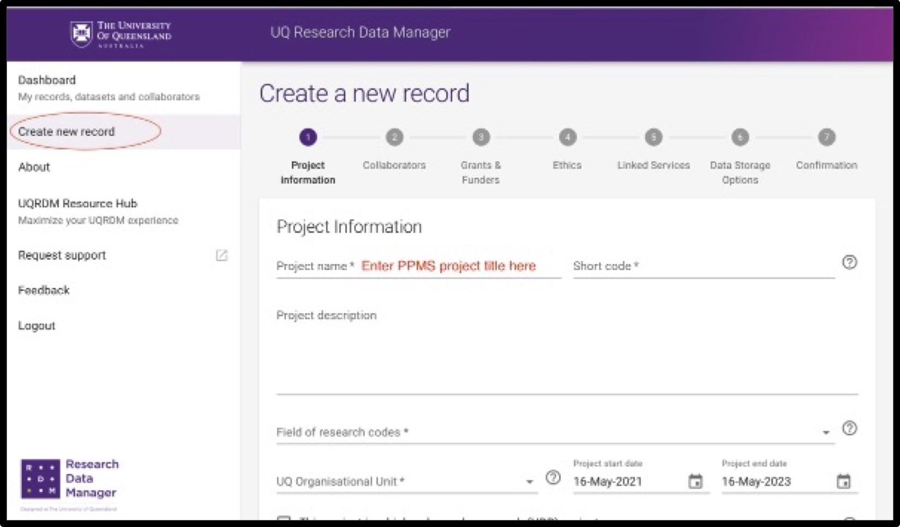
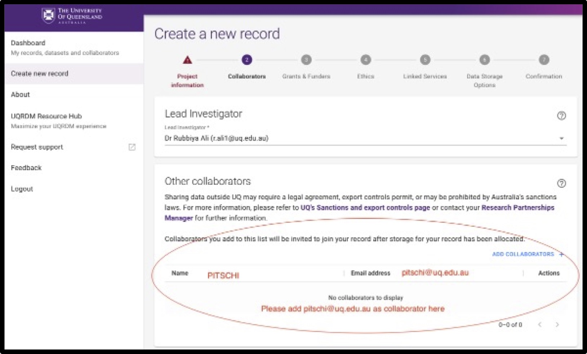
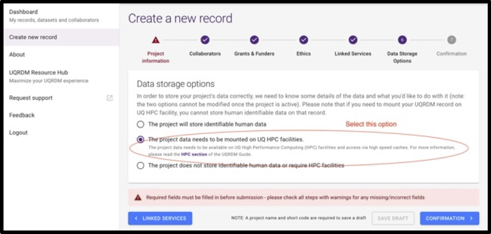

## What is PITSCHI?

**Particle Imaging depoT using Storage caCHing Infrastructure (PITSCHI)** is a data repository for the Centre for Microscopy and Microanalysis developed and established with UQ’s partner RCC and digital services. We plan to roll out PITSCHI on all CMM data acquisition instruments. The benefit for users is your data will be copied and hosted in your “own research RDM”. So there won’t be any worries of data transfer/loss etc. An 8-month test phase has proven its functionality and ease of use.

## How to use PITSCHI?
To use PITSCHI workflow, each user needs to set up a project [UQRDM](https://research.uq.edu.au/rmbt/uqrdm) collection (new or existing) to save data in your project RDM collections directly from the instrument. PITSCHI will offer, once data and metadata are transferred and extracted, to use a Web browser to navigate through your experiments and datasets, and it allows you to start data/image processing software on our high-performance computing (HPC) clusters directly out of PITSCHI. Over the years, we will enrich your datasets with more metadata, which is your research and UQ's asset.

## How do I link/create an UQRDM collection for my project?

### Option 1: If you have an existing UQRDM collection (Q-collection)

You can use it for your CMM project only if:

- It is linked to your CMM project registered in [RIMS](https://rims.uq.edu.au/login/?pf=2).
- It is mountable to HPCs at UQ (so-called Q-collection).

please do the following:

- Add pitschi@uq.edu.au as a collaborator in the Q-collection.
- Please send the **UQRDM collection ID** to cmm-support@uq.edu.au.

	
<h3> Click here if you don't know where to find your collection ID?</h3>

	
Please follow the instructions to find your UQRDM collection ID. 
	
  
1. Please click on the following link to login into your UQRDM collection with your UQ credentials.
  http://rdm.uq.edu.au/
	
	
2. After login, please click on ‘Access Storage’.
	

	
	
3. It’ll open another window with your UQRDM collection ID. 
	

		

### Option 2: If you do not have any UQRDM collection

If you do not have a UQRDM collection that meets the above requirements, you need to create a new one.

If you dont know how to create a new collection, please click on **details**

	
<h3> Click here if you don't know how to create a new UQRDM collection?</h3>

Please follow the instructions to create your new UQRDM collection. 
	
	  
1. Please click on the following link to create a new UQRDM collection for PITSCHI and login with your UQ credentials. 
  http://rdm.uq.edu.au/
	
	
	
2. Click on ‘ Create new record’ on left sidebar of the page and add all details asked in the form.
	
	

3. When it asks for Project name, please enter your complete ‘PPMS Project title’ (see screenshot below). 
	
	

		
  
 4. Please add pitschi@uq.edu.au as collaborator in the record. 
	

	  
 5.	Under ‘data storage options’ please select ‘project data needs to be mounted on UQ HPC facilities'
	
 
  
  6.	When you submit the form, and receive a confirmation from UQRDM team, please send the UQRDM collection number to cmm-support@uq.edu.au
	

## PITSCHI Training:

### PITSCHI: A FAIR dataset management solution for CMM scientific instruments

Please [register](https://cmm.centre.uq.edu.au/pitschi) to attend **PITSCHI HOUR/FAIR Datahandling**. Join us to learn about scientific data management, [FAIR](https://ardc.edu.au/resource/fair-policy-for-ardc-and-ardc-co-investment-project-materials/) principles, and your data handling at the [Centre for Microscopy and Microanalysis (CMM)](https://cmm.centre.uq.edu.au/) at [The University of Queensland](https://www.uq.edu.au/). The weekly event helps connect the dots between the research data life cycle from your research and data generated at CMM and how to use PITSCHI in your workflow i.e. how to save data directly in your or your group’s project RDM collections from CMM instruments. We’ll address any questions and/or help you integrate your UQRDM collections with PITSCHI.

