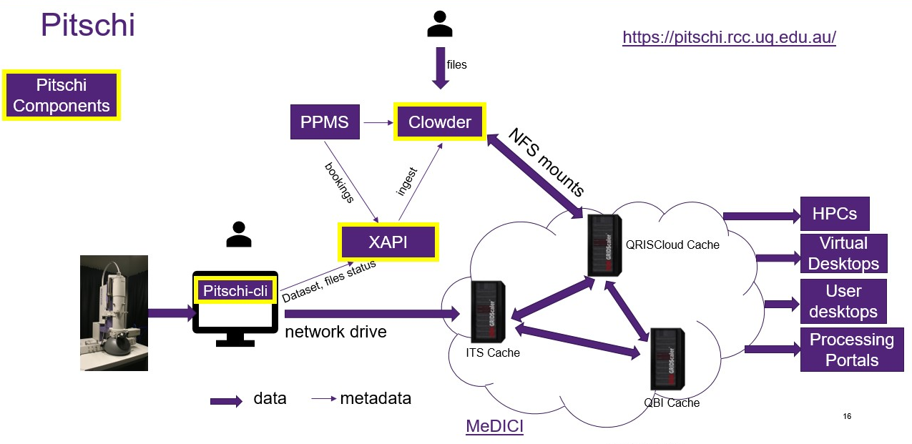
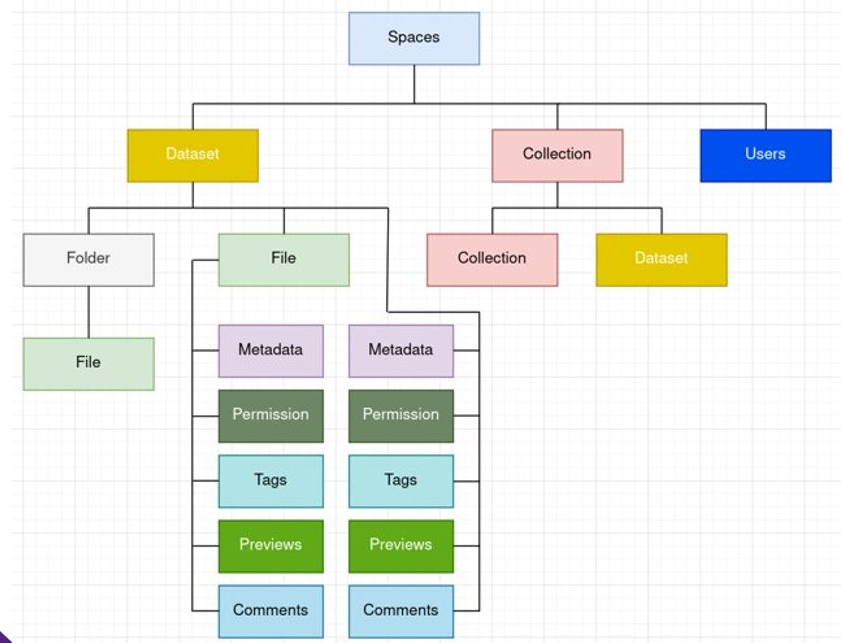
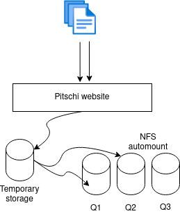
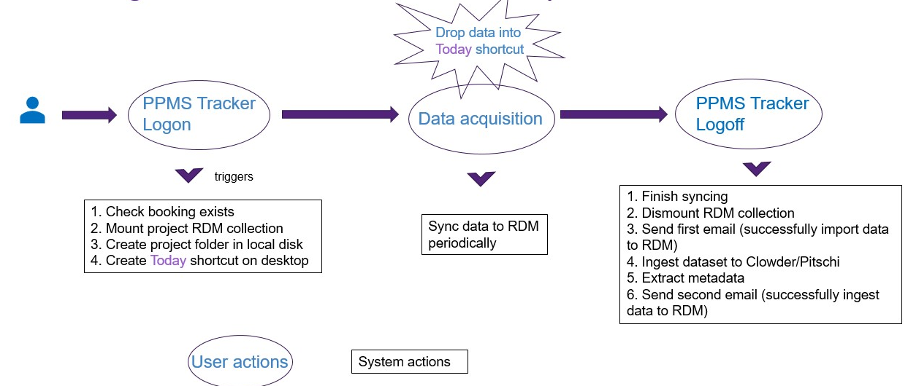

# Status
In construction

# Purpose
This technical guide explains the components of Pitschi and how they work together.

# Components

Pitschi relies on the [MeDICI](https://rcc.uq.edu.au/data-storage) for data movement and [UQ RDM](https://research.uq.edu.au/rmbt/uqrdm) for data storage. The booking information is queried from PPMS.

Pitschi consists of the following components:
* **[Clowder](github.com/UQ-RCC/clowder)**: a modified version of the Clowder framework for data management and automatic metadata extraction
* **[XAPI](github.com/UQ-RCC/xapi)**: an API to manage data importation from RDM storage collections. The booking information from PPMS is cached in this XAPI as well. 
* **[Pitschi-cli](github.com/UQ-RCC/pitschi-cli)**: A desktop client residing in the instrument computers for syncing datasets and files to the project's storage collection.  

# Deployment
Pitschi is deployed on a [Docker Swarm Cluster](https://docs.docker.com/engine/swarm/) on top of the [QRISCloud](https://www.qriscloud.org.au/) (OpenStack) research cloud. [Ansible](https://www.ansible.com/) 2.9 is used provision the stack. The deployment code can be found [here](https://github.com/UQ-RCC/ansible-swarm-clowder)

# Data management

In Clowder, space is the highest level in hierarchy of data organization. Space consists of datasets, and within datasets, there are files and folders. Collection is a group of datasets. Users can generally create spaces by themselves and within each space and dataset, what users can do is limited by their roles. A more detailed description of Clowder can be found [here](https://clowder-framework.readthedocs.io/en/latest/userguide/ug_index.html)

In Pitschi, while the data hierarchy is the same, we have modified the access control to fit our data flow. This section of the guide details how data management is done is Pitschi.

## User accounts and access controls
In Pitschi, manual creation of accounts and spaces is disabled. Instead, projects and its accounts are synced from PPMS. 

UQ users will need to use UQ SSO to log into Pitschi, while external accounts are created using email address supplied from PPMS. 

## Data organisation

### Overview

### Project level data organisation

# Data ingestion

## Web ingestion

## RDM ingestion
