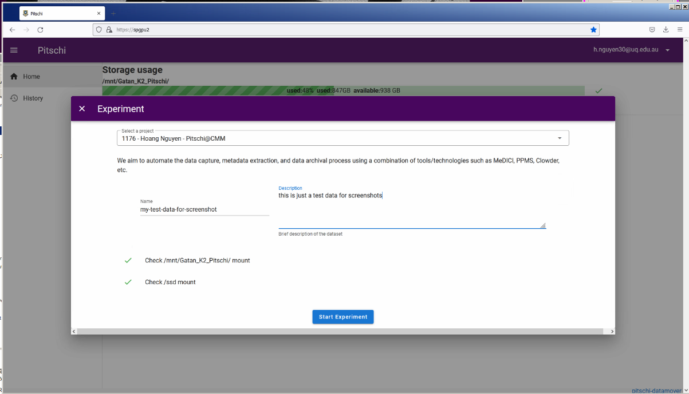
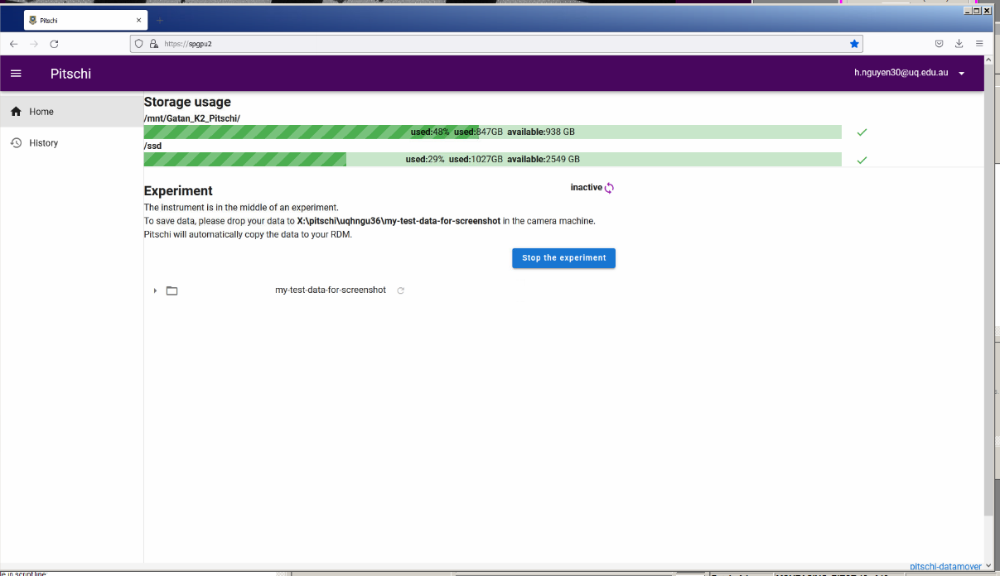

Pitschi datamover is a Web service that is in charge of syncing data from the instrument computer to the project's RDM collection via an intermediate computer (support machine or preprocessing machine). This guide is to show you how to use it, and the steps on how to prepare your project with Pitschi.

# Setup

Please note that this setup process takes time as some steps need to be done by other IT personnels at UQ 

1. First you need to make sure you have an account, and an active project in PPMS
2. Second you need to make sure you have an existing RDM for your project. If you do not have a RDM, please request one at (https://rdm.uq.edu.au/). Please make sure you tick the option "**The project data needs to be mounted on UQ HPC facilities**"
3. Make sure you add Pitschi (pitschi@uq.edu.au) as a collaborator to your project RDM. 
4. Fill up the email template [here](mailto:pitschi@uq.edu.au?&subject=Pitschi%20datamover%20setup&body=To%20whom%20it%20may%20concern%2C%20%0A%0ACould%20you%20please%20help%20me%20with%20setting%20up%20Pitschi.%0A%0A%20%20%20%20Instrument%20name%3A%20%0A%20%20%20%20My%20PPMS%20project%20is%3A%20%0A%20%20%20%20My%20project%20RDM%20is%3A%20%0A%20%20%20%20Are%20you%20going%20to%20use%20CVL%40Wiener%20for%20processing%20%3F%20%5BYes%2FNo%5D%20%0A%0A%20Regards) with your own details.

5. We will send you a confirmation email once the setup is completed. 

# Usage

1) Open Firefox in the camera machine. Click on the "Pitschi datamover" button in the bookmark toolbar. It will take you to the [Australian Access Federation](https://aaf.edu.au) single signon page. 

2) Choose organisation

3) Onced signed in, you will be directed to the homepage. 

4) As soon as you are about to start acquiring data, press "Start a new experiment" button. A pop-up will appear. 

you need to select a project from the dropdown list, then enter the experiment name and description. **Try to avoid having spaces in the experiment name**

5) Once the experiment is started, it will show where you should drop the data from the camera machine. Pitschi will sync the data from there to your RDM periodically.  

6) Once you finish collecting data, you can stop the experiment. If you choose to delete the source data, it will be deleted **if and only if your data has been synced successfully to your RDM**.  

7) You can also visit your previous experiments in the "History" tab.

